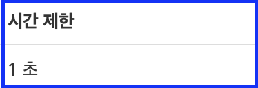

# 25.04.03 TIL

### 오늘의 문제
---

* **문제 링크**: https://www.acmicpc.net/problem/2468
* **난이도**: 솔직히.. 쉽지는 않았다. 그야말로 제대로 호되게 당한 격. 그래도 1시간 안에는 겨우 풀 수 있을 듯
* **유형**: #시뮬레이션 #BFS

문제를 풀면서 어려웠던 부분은 다음과 같다. 제일 어려운 것부터 차례대로...

1. **시간 제한** 문제
2. **방문 설계** 문제
3. 테스트케이스

#### 1 시간 제한
1번 부터 보자면, 음... 시간 초과 문제인데, 이게 **입력 조건**과 관계가 있었다.



BFS 를 설계하기 위해서는 $N$ 회차에 대해, $N$x$N$ 의 격자에서, $N$ 번의 BFS 를 실행하는 게 시간 제한 내로 가능한지를 판단해야 한다.

최악의 케이스, $N=100$, $N^4$ 으로 $10^8$ 시간 제한 내로 가능한 로직을 설계하면 충분하다

#### 2. 방문 설계 문제
1번을 어떻게 만족시키는 설계를 어떻게 구현해야할까. 
즉, 4겹 형태의 N번 순회 내로 구현해야하는 목표가 있다.

1번의 N, $N$x$N$, N 에 대해 다음과 같이 정의할 수 있다.

* **N 회차**: 높이가 N 이하 잠기는 회차
* **$N$x$N$ 격자**: BFS 를 실행할 2차원 격자
* **N 의 BFS**: 방문을 잘 설계하면 격자 및 BFS 를 $O(N^3)$ 으로 가능

그러면 방문을 어떻게 설계하는 것이 맞을지.. 여기서 중요한 것은 매 회차시, 

1. 현재 회차에서 영역의 개수를 파악하고
2. 다음 회차를 위한 초기화

가 진행되어야 한다는 것이다. 이를 모두 만족시키는 설계는 다음과 같다.
즉, 매 회차에서 격자에서 특정 조건 하에 높이를 일정하게 감소시키는 것

```
   for (int h = h_max; h > 0; h--) {
      int h_result = 0;
      int tmp = 0;

      for (int i = 0; i < n; i++) {
         for (int j = 0; j < n; j++) {
            if (board[i][j] <= h) continue;

            queue<pair<int, int>> Q;
            Q.push({i, j});
            while (!Q.empty()) {
               pair<int, int> cur = Q.front();
               Q.pop();
               for (int dir = 0; dir < 4; dir++) {
                  int nx = cur.X + dx[dir];
                  int ny = cur.Y + dy[dir];
                  if (nx >= n || nx < 0 || ny >= n || ny < 0) continue;
                  if (board[nx][ny] <= h) continue;
                  board[nx][ny] = h;
                  Q.push({nx, ny});
               }
            }
            tmp++;
         }
      }
```


#### 3. 테스트케이스
별 것은 없다. 그냥 역시 경계값. 다음의 테스트케이스로 해결했다

**input**
```
3
1 1 1
1 1 1
1 1 1
```
**wrong output**
```
0
```
**correct output**
```
1
```

단순히 `int ans=1;` 초기화를 통해 무사히 해결했다.


### 소감
까불지 말자.