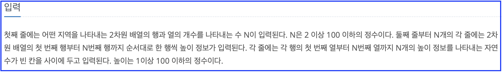

# 25.04.02 TIL

### 오늘의 문제
---

* **문제 링크**: https://school.programmers.co.kr/learn/courses/30/lessons/161990
* **난이도**: 당황스럽긴 하지만,, 그래도 쉬운 문제
* **유형**: #시뮬레이션

프로그래머스로 이전에 문제를 풀어본 것도 같은데,,, 음.. 여전히 당황스런 방식의 입력이다.
여튼 문제를 푸는 데는 큰 문제는 없었다.

여기서 확인해보면 좋을 사항은, 출력이 되는 값 [x1, y1, x2, y2] 에 대해 x1, x2 를 구하는 방법이 조금 다를 수 있다는 거?

이렇게 다른 이유는 **파일** 이 실제로는 그림과 같이 **1과 2 사이** 에 있기 때문이다. 
따라서 1개의 파일이라 하더라도 직사각형의 크기는 1이다. 0이 될 수 없다는 말이다.

이정도면 충분한 거 같다.

오늘은 2222만~~