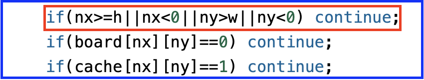

# 25.04.07 TIL

### 오늘의 문제
---

* **문제 링크**: https://www.acmicpc.net/problem/4963
* **난이도**: 솔직히 45분 걸릴 문제가 아니었으나... 오타... 반성하자
* **유형**: #BFS

## BFS 정리
---

문제는 어렵지 않다. 많고 많은 BFS 문제 유형중 하나다.
기왕 하는 김에 BFS 정리 좀 해본다.

1. 영역 개수 구하기
2. 영역 크기 구하기
3. 거리 구하기

#### 1. 영역 개수 구하기
이어진 영역을 탈출하는 시점에 +1 이 되도록 설계해야 한다. 
일반적으로 격자 상의 이중 for 문을 돌면서 구하기는 하지만, 입력 시점에 조건에 맞는 좌표를 따로 빼두어 구현할 수도 있다.
```
for(int i=0;i<n;i++){
	for(int j=0;j<m;j++){
		if(vis[i][j]==0) continue;
		vis[i][j]=1;
		...
		BFS();
		...
	}
}
```

#### 2. 영역 크기 구하기
BFS 를 돌면서 +1 이 되도록 구현한다. 간단하지 코드는 생략

#### 3. 최단 거리 구하기
방문 행렬을 변형해서 사용한다. 나는 round 라고 표현하는데, 여기서 round 란 보통 BFS 를 회차마다 반복하는 경우를 뜻한다.
이러한 경우, 시간복잡도를 꽤나 신경써야 하는데.. **영역 개수 + 최단 거리** 와 같은 경우 시간복잡도에서 과부하가 충분히 올 수 있음을 인지하고 설계해야함..
가장 일반적인 **최단 거리 구하기** 예시
```
fill_n(&dist[0][0],(n+2)*(m+2),-1);
dist[init.X][init.Y]=0;
q.push(init);
while(!q.empty()){
	pair<int,int> cur=q.front();
	q.pop();
	for(int dir=0;dir<4;dir++){
		int nx=cur.X+dx[dir];
		int ny=cur.Y+dy[dir];
		if(nx>=n||nx<0||ny>=m||ny<0) continue;
		if(dist[nx][ny]>=0) continue;
		dist[nx][ny]=dist[cur.X][cur.Y]+1;
		q.push({nx,ny})
	}
}
```

일반적으로는 3개 중 하나 혹은 그 중 조합된 방향으로 문제가 출제되는 듯하다. 풀다가 다른 방식의 BFS 가 등장한다면,,, 또 그때..


## 문제에서 얻은 것(?)

앞서 말한대로,, 쉬웠으나 47 분이나 걸린 것은 분명 이유가 있다. 
(참고로, 해당 문제는 단순.. 단순 1번 문제에 해당)

바로,, 아래의 코드에서 오타가 있었다.


이게 별게 아니지만,, 이거를 그렇게 못찾아서.. 한 20분 이상 헤멨다..
로직 설계상 **정말!!** 문제가 없을 거라 자신했기 때문에, 도대체 뭐가 문제인지 헤멨던 듯 ㅎ..

여튼 여기서 배워갈 것은,

* **로직 설계에 자신있다면, 오타 검수!**

정도인 것 같다. 메인 리드미에 추가 +1